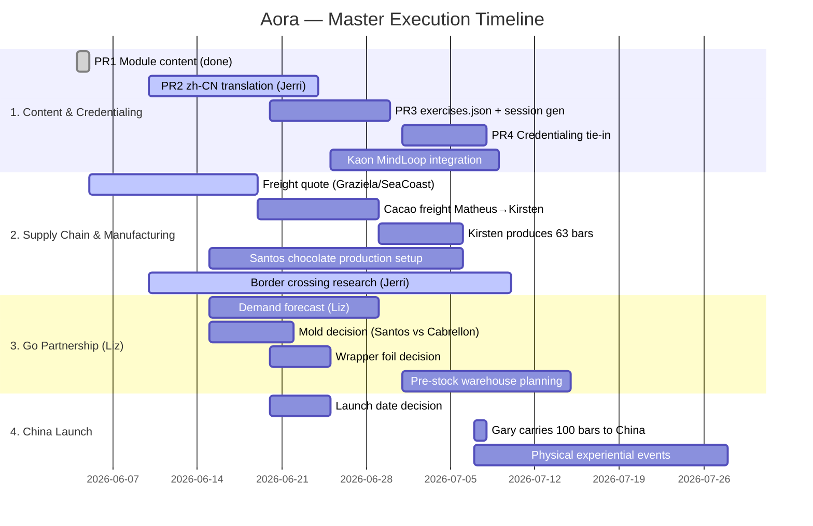

# Autopilot Session — 2026-06-11

**Session**: `9948f0dd2721`

**Governor**: Gary Teh

---

### 🧑 Governor

 You are speaking with Gary Teh. When they say 'I', 'me', or 'my', they mean Gary Teh.]

[Telegram context: chat_id=-1003919341801, thread_id=2312] [Handoff context — this Telegram topic (thread 2312) may be an execution handoff. If the governor gives a go-signal ("go for it", "go", "proceed") or references a plan/mission, find this thread in agentic_ai_context/HANDOFF_MANIFEST.md + SOPHIA_HANDOFFS.md via read_context_file, open the referenced `*_PLAN.md`, and resume from its RESUME HERE. Do NOT reply that you lack context without checking the registry first.]

I think now that the collaboration with Liz on Go and Aora has expanded, it makes sense to establish its own set of implementation roadmap and execution roadmap and check list. What are your thoughts?

### 🤖 Autopilot

Great timing. Let me first check the handoff manifest and any existing context around the Liz / Go / Aora collaboration to see what's already been documented.

### 🤖 Autopilot

No existing context on a "Liz / Go / Aora" collaboration in the DAO docs. Let me search more broadly.

### 🤖 Autopilot

Good — there's existing context. Let me read the Aora plan and the relevant advisory snapshot section to understand the full picture.

### 🤖 Autopilot

Let me also search for "Liz" more specifically and check if there's anything about the expanded collaboration.

### 🤖 Autopilot

I see the picture now. Here's my analysis:

---

**Yes, I agree — it's the right time to formalize this.**

Here's what I can see from the existing context:

**What exists today:**
- `AORA_EXPERIENCE_PLAN.md` — covers the learning modules (Agroforestry + Supply Chain), PR1 merged, PR2 (zh-CN) pending Jerri's team, PR3 (session generator) and PR4 (credentialing) not started.
- The plan references "Mr. Cao's GO/Nucleus network" as the China launch partner.
- Timeline runs through Jul 7–end Jul (Gary in China).

**What's missing (the gap you're pointing at):**
- No mention of **Liz** anywhere in the DAO context — she's a new collaborator.
- No separate **implementation roadmap** (the tactical *how* — who does what, by when, with what dependencies).
- No **execution checklist** (per-step verification, gates, deliverables sign-off).
- The existing plan is a *product* roadmap (modules → site → credentialing). The collaboration with Liz on Go and Aora adds a *partnership execution* dimension that the current plan doesn't cover.

**My recommendation:**

Let's create a **`AORA_GO_COLLABORATION_PLAN.md`** (or similar) that sits alongside `AORA_EXPERIENCE_PLAN.md` and covers:

1. **Scope of Liz's involvement** — what she owns vs. what you own vs. what's shared
2. **Go integration specifics** — how the GO app/Nucleus network interfaces with Aora (engine-agnostic exercises → GO's session recomposition)
3. **Implementation roadmap** — sequenced milestones with owners, dates, and dependencies
4. **Execution checklist** — per-milestone: deliverables, verification steps, sign-off gates
5. **Communication cadence** — syncs, async updates, escalation path

The existing `AORA_EXPERIENCE_PLAN.md` stays as the product/feature roadmap. The new doc is the **partnership execution layer** — who does what, when, and how we know it's done.

Want me to draft it? I can:
1. Read the current `aora` repo to see what's there
2. Draft the collaboration plan as a PR to `agentic_ai_context`
3. Open a dedicated Telegram topic for tracking execution

Or if you'd rather just tell me the key details about Liz, Go, and the expanded scope, I'll incorporate them.

### 🧑 Governor

[Telegram context: chat_id=-1003919341801, thread_id=2312] [Handoff context — this Telegram topic (thread 2312) may be an execution handoff. If the governor gives a go-signal ("go for it", "go", "proceed") or references a plan/mission, find this thread in agentic_ai_context/HANDOFF_MANIFEST.md + SOPHIA_HANDOFFS.md via read_context_file, open the referenced `*_PLAN.md`, and resume from its RESUME HERE. Do NOT reply that you lack context without checking the registry first.]

Liz is Elizabeth Wong.

### 🤖 Autopilot

Got it — Elizabeth Wong. Let me search for any existing references to her full name in the DAO context.

### 🤖 Autopilot

So Elizabeth Wong is a known customer (purchased 37 bars in April 2026) — and now she's becoming a **collaborator** on Go and Aora. That's a meaningful relationship evolution.

To draft the right plan, I need a bit more context from you:

1. **What's Liz's role?** Is she leading the Go integration (Kaon's GO app/Nucleus network), co-designing the Aora modules, running the China salons, or something else?

2. **What does "Go" mean here?** The existing Aora plan references "Mr. Cao's GO/Nucleus network" — is Liz working with/for Mr. Cao, or is she a separate partner bringing her own Go expertise?

3. **What's the expanded scope?** Beyond what's in `AORA_EXPERIENCE_PLAN.md` (modules → site → credentialing), what new work does the Liz collaboration unlock?

Once I have those, I'll draft the collaboration plan as a PR to `agentic_ai_context` and we can open a dedicated tracking topic.

### 🧑 Governor

[Telegram context: chat_id=-1003919341801, thread_id=2312] [Handoff context — this Telegram topic (thread 2312) may be an execution handoff. If the governor gives a go-signal ("go for it", "go", "proceed") or references a plan/mission, find this thread in agentic_ai_context/HANDOFF_MANIFEST.md + SOPHIA_HANDOFFS.md via read_context_file, open the referenced `*_PLAN.md`, and resume from its RESUME HERE. Do NOT reply that you lack context without checking the registry first.]

She is leading the Go. Correct. All your references are correct. It falls under the Aora experience plan.

### 🤖 Autopilot

Let me re-read the Aora plan to get the full picture fresh, then I'll draft the collaboration layer.

### 🤖 Autopilot

Good. Now I have the full picture. Here's my proposal:

---

**I agree — the Liz/Go collaboration needs its own structured layer within the Aora plan.**

The current `AORA_EXPERIENCE_PLAN.md` is a **product roadmap** (modules → site → credentialing). What's missing is the **partnership execution layer** — specifically:

**What Liz brings (Go/Nucleus):**
- She leads the Go side — Kaon's GO app / Nucleus network
- The engine-agnostic exercises in the Aora modules need to be recomposable by Go
- There's a technical integration interface (exercise schema → Go's session format)
- There's a go-to-market coordination (salons, pilot events, China launch)

**What a dedicated collaboration plan should cover:**

| Section | What |
|---------|------|
| **Roles & boundaries** | Liz (Go engine, session recomposition, China ops) vs. Gary (module content, QR/ledger, credentialing) vs. Jerri (zh-CN, salon logistics) |
| **Go integration spec** | Exercise schema contract — what the `data/exercises.json` must expose for Go to consume; API or file-based handoff |
| **Implementation roadmap** | Parallel tracks: Liz's Go integration work + Gary's module/content work + Jerri's localization/events — with dependency gates |
| **Execution checklist** | Per-milestone: deliverables, verification, sign-off |
| **Communication cadence** | Syncs, async updates, who escalates what |

**My suggestion:** Create it as a **new section within `AORA_EXPERIENCE_PLAN.md`** (rather than a separate file) since it's the same program — just the partnership execution layer that the original plan didn't capture because Liz wasn't in the picture yet.

Alternatively, if you prefer a standalone doc, I'd name it `AORA_GO_PARTNERSHIP_PLAN.md` and cross-link it from the main plan.

**Want me to draft it?** I'll need a few details from you:

1. **What's the Go integration interface?** Does Liz need a specific JSON schema for exercises, or is it a file handoff, or an API?
2. **What's Liz's timeline?** Does she have her own milestones (GO app readiness, salon scheduling) that need to gate the Aora content delivery?
3. **Any specific deliverables Liz is expecting from you** (beyond what's already in the plan) — or vice versa?

Once I have those, I'll draft the plan as a PR to `agentic_ai_context` and we can open a dedicated tracking topic.

### 🧑 Governor

[Telegram context: chat_id=-1003919341801, thread_id=2312] [Handoff context — this Telegram topic (thread 2312) may be an execution handoff. If the governor gives a go-signal ("go for it", "go", "proceed") or references a plan/mission, find this thread in agentic_ai_context/HANDOFF_MANIFEST.md + SOPHIA_HANDOFFS.md via read_context_file, open the referenced `*_PLAN.md`, and resume from its RESUME HERE. Do NOT reply that you lack context without checking the registry first.]

Jerri works for Liz on her team. 

So basically on Agroverse TrueSight DAO side we offer

- cacao supply chain from Brazil to where it lands
- conversion from cacao beans into chocolate bars
- handling of warehousing and storage of cacao beans from farmers during harvesting season
- converts cacao beans into chocolate bars

- Credentialing layer which is being utilized by the service that Kaon is building on. Kaon who is a partner she brough it. He is building MindLoop engine. Basically allows people to build experientail learning modules and publish. We will use it to publish an experiential learning module. And when people complete, it will generate a record on our credentialing layer.

- I think jerri is right now also researching border crossing into china for our cacao. 

- She has past us details of the chocolate mold which they produce in China. Liz is thinking of purchasing them and then I pick it up from her and drop it off in Santos (not sure if that route is happening right now) since Jerri was mentioning that Parents and students in China are not going to be around in JUly. So not very sure.

- Fatima has spoken with Santos, she suggested the following as a proper document which both English and Portugess which she can then use for communication with Santos. 

Notes from conversation with Fatima this morning

- whose to cacao (ours which we source directly from the farm)
- percentage of cacao (81% until other wise - perhaps to indicate this as a decision to be make when Liz has more market visibility)
 - proportion (19% sugar )

- amount required per month 
- wrapper foil (who provides)

- best case scenario and secondary 

- mold will be stored with Matheus
- collect bars and the shell, the mold

Outcomes
- How many chocolate mold he needs

Prior conversation with Santos
-SANTOS: it works like this… 
He makes a 70% cacao bars, but it can be (60%cacau + 10%cacau butter) or (63% cacao + 7% cacau butter) or (65% cacau+ 5%cacau butter). The 30% can be regular sugar or Demerara sugar (rustic, rough, not so refined, kind of brown sugar).
For any combination of 70% the price is R$130,00/kg. He delivers in 40 gr bars in basic laminated package. Will send you videos showing the packages.

The current mold he has produces 40 gram chocolate bars. He mentioned he is ok trying to make the bars to 50grams. 

The sizes different from the ones we use in San Francisco which Kirsten has 
Polycarbonate mold 27.5cm x 17.5cm with 4 cavities / 50g

Cavity dimension: 13cm x 5.5cm, 0.6cm deep

It's a standard mold made in Italy - I'll ask about the manufacturer

https://www.chocolat-chocolat.com/product/art1116-chocolate-bar-mold/
Made by Cabrellon (Italy)
https://www.cabrellon.it/

Jerri has found the one that is exactly similar to the mold we are using in San Francisco

Santos Dimension mold dimension is
Barras de 40g 
07x06

Sr Santos, veja se eu entendi:

- a barra tem 7cm X 6cm

Ela é quase um formato quadrado. É isso?

Based on discussion with Fatima, she mentions she needs the expected kilogram of chocolate production per period before Santos can know how many chocolate molds he needs. My sense is if we dont provide as much mold then his through put capacity is limited. 

Perhaps in the execution roadmap, we should indicate for Liz to indicate to us the expected demand the china retailers and distributors are expecting per year. Likely we will need to pre-stock the chocolate bars into the warehouse

Omega services is alot of friction. So lesser number of freights is better.

Originally the launch in July with the students and parents is a physical experiential leraning experience with two parts (reference our context farm and supply chain, I believe it is somewhere)

Was expecting once Kaon is done with his engine, I use his engine to generate experiential learning module like Capoeira, Butterfly effect and Oracle experience.

And we run that experience in china.

### 🤖 Autopilot

This is a lot of rich context. Let me synthesize what I'm hearing and propose the right structure.

Let me check what's in the `aora` repo to see the current state of things.

### 🤖 Autopilot

Now I have the full picture. Let me also check if there's anything about Kaon/MindLoop in the context.

### 🤖 Autopilot

All new context. Here's my synthesis of what you've laid out and my recommendation:

---

**You're describing three interconnected workstreams that the current `AORA_EXPERIENCE_PLAN.md` doesn't cover.** The original plan was a content roadmap (two modules → site → credentialing). What's emerged is a full **supply chain + manufacturing + experiential learning partnership** with Liz/Go/Kaon.

Here's how I see the layers:

### Layer 1: The Aora Experience (existing plan)
- Content modules (Agroforestry, Supply Chain) — **done** (PR1 merged)
- zh-CN translation — Jerri's team (Liz's team)
- Session generator + credentialing — fast follow

### Layer 2: Go/MindLoop Integration (new — Liz + Kaon)
- Kaon's MindLoop engine as the experiential learning platform
- Aora modules published as MindLoop experiences
- Credentialing layer triggered on completion → TrueSight DAO Lineage
- This is the **technical partnership interface** — exercise schema contract between Aora's `exercises.json` and MindLoop's engine

### Layer 3: Supply Chain & Manufacturing (new — Liz + Santos + Fatima)
- Cacao sourcing (ours, direct from farm)
- Chocolate production with Santos (81% cacao / 19% sugar, 40g bars, R$130/kg)
- Mold specs — Santos's 40g bars vs. Cabrellon Italian mold (50g, 4 cavities)
- Border crossing into China (Jerri researching)
- Pre-stocking warehouse, freight cadence (Omega = friction, minimize trips)
- Demand forecasting needed from Liz (retailers/distributors → annual kg → mold quantity → throughput)

### Layer 4: China Launch (new — Liz + Jerri + Gary)
- July timeline uncertain (parents/students not around in July)
- Physical experiential learning events (farm + supply chain modules)
- Potentially shifted timeline

---

**My recommendation: restructure the Aora plan into a proper multi-workstream document.**

I'd suggest updating `AORA_EXPERIENCE_PLAN.md` to become the **master coordination document** with four sections:

1. **Content & Credentialing** (the original plan — modules, MindLoop integration, Lineage)
2. **Supply Chain & Manufacturing** (Santos production, mold, border crossing, warehousing)
3. **Go Partnership** (Liz's role, Kaon's MindLoop, demand forecasting, market visibility)
4. **China Launch** (salons, timeline, Jerri's logistics)

Each section gets its own implementation roadmap + execution checklist with owners, dependencies, and gates.

**Want me to draft this as a PR?** I'll:
1. Rewrite `AORA_EXPERIENCE_PLAN.md` with the four workstreams
2. Keep all existing content (PR0, PR1 are done) and add the new tracks
3. Add a clear **decision log** for open questions (mold size, July timeline, demand forecast, border crossing status)
4. Open the PR for your review

Or would you prefer I start with just the **execution checklist** layer first — a separate `AORA_EXECUTION_CHECKLIST.md` that tracks per-item status — and update the main plan separately?

### 🧑 Governor

[Telegram context: chat_id=-1003919341801, thread_id=2312] [Handoff context — this Telegram topic (thread 2312) may be an execution handoff. If the governor gives a go-signal ("go for it", "go", "proceed") or references a plan/mission, find this thread in agentic_ai_context/HANDOFF_MANIFEST.md + SOPHIA_HANDOFFS.md via read_context_file, open the referenced `*_PLAN.md`, and resume from its RESUME HERE. Do NOT reply that you lack context without checking the registry first.]

Kirsten has already produced a bunch of chocolate bars, Liz needs a total of 100 bars. Check the records to see how many bars she bought. That way we know the outstanding

Also right now Omega services and working with Graziela from SeaCoast Logistics to get a new freight of cacao shipped from matheus warehouse to Kirsten warehouse. Once the freight arrives, Kirsten will produce the outstanding. If the July launch happens, then I will bring the 100 bars with me physically to go to china. 

Can you help organize the details and let's discuss and then compile as  PERT chart (using mermaid diagram) perhaps on the AORA experience.

thoughts?

### 🤖 Autopilot

Let me check the records on Elizabeth Wong's purchase and the current inventory situation.

### 🤖 Autopilot

Good — Elizabeth Wong purchased **37 bars** (20 Oscar 2024 + 17 Santa Ana 2023) in April 2026. She now needs **100 bars total**, so the **outstanding is 63 bars**.

Let me also check the current inventory and freight status.

### 🤖 Autopilot

Excellent — I now have the full picture. Let me also check the current inventory to see what's available.

### 🤖 Autopilot

Now I have the full picture. Here's my organized summary and proposal:

---

## Current State Summary

**Elizabeth Wong's purchase history:**
- **Already bought:** 37 bars (20 Oscar 2024 + 17 Santa Ana 2023) — April 2026
- **Needed total:** 100 bars
- **Outstanding:** **63 bars** to be produced by Kirsten

**Supply chain status:**
- New cacao freight from Matheus's warehouse (Ilhéus) → Kirsten's warehouse (SF) — in progress via Omega/SeaCoast (Graziela)
- Airline quote still pending per OPEN_FOLLOWUPS.md (Graziela waiting on airline revalidation since June 5)
- Once freight arrives, Kirsten produces the outstanding 63 bars

**July launch uncertainty:**
- Parents/students may not be around in July
- If launch happens, you physically carry the 100 bars to China
- If not, timeline shifts — but the bars still need to be produced

---

## Proposed: AORA_EXPERIENCE_PLAN.md restructure with PERT chart

I propose we update `AORA_EXPERIENCE_PLAN.md` to become a **master coordination document** with four workstreams, each with its own execution checklist, and a **PERT chart** (Mermaid) showing dependencies.

Here's the PERT chart I'd draft:

**Key dependencies (critical path):**
1. Freight quote → cacao arrives → Kirsten produces 63 bars → Gary carries to China
2. Liz's demand forecast → Santos mold quantity → production throughput
3. Kaon's MindLoop ready → publish Aora modules → credentialing live

**Open decisions to flag in the plan:**
- July launch: happening or shifted? (affects everything)
- Santos mold vs Cabrellon mold (affects bar size: 40g vs 50g)
- Wrapper foil: who provides?
- Demand forecast from Liz: annual kg needed → mold count → freight cadence

---

**Want me to draft this as a PR?** I'll:
1. Rewrite `AORA_EXPERIENCE_PLAN.md` with the four workstreams, PERT chart, and execution checklists
2. Add a decision log for all open items
3. Keep all existing completed work (PR0, PR1) intact
4. Open the PR for your review

Shall I go ahead?

### 🧑 Governor

[Telegram context: chat_id=-1003919341801, thread_id=2312] [Handoff context — this Telegram topic (thread 2312) may be an execution handoff. If the governor gives a go-signal ("go for it", "go", "proceed") or references a plan/mission, find this thread in agentic_ai_context/HANDOFF_MANIFEST.md + SOPHIA_HANDOFFS.md via read_context_file, open the referenced `*_PLAN.md`, and resume from its RESUME HERE. Do NOT reply that you lack context without checking the registry first.]

Mold decision (Santos vs Cabrellon) has already been decided we will be using Cabrellon dimensions... Let's indicate clearly the assumption is that Liz side will provide the final packing and we deliver the bars in generic foil.. 

Jerri and her team mate are right now repackaging the cacao for the chinese market. 

Also not sure how much cacao to stock because zero visibility on China market Aora GO requirements. DAO capital has already been deployed and will be deplyoed to the freight already bound for USA. Amount in AGl15 as well as our main ledger.

### 🤖 Autopilot

Excellent — that clarifies several key decisions. Let me capture all of this precisely before drafting.

Let me also check the AGL15 and Main Ledger amounts to reference accurately.

### 🤖 Autopilot

Now I have everything. Let me draft the updated plan as a PR.

### 🤖 Autopilot

Right — I need to provide the actual file content. Let me read the current file and prepare the rewrite.

### 🤖 Autopilot

Now I'll write the full replacement.

### 🤖 Autopilot

PR is open: **https://github.com/TrueSightDAO/agentic_ai_context/pull/423**

Here's a summary of what the restructured plan contains:

---

### What changed

The old plan was a single-track product roadmap (modules → site → credentialing). The new plan has **four workstreams** with a PERT chart showing dependencies:

| Workstream | Key items |
|---|---|
| **1. Content & Credentialing** | PR0–PR4 (existing), plus Kaon's MindLoop integration |
| **2. Supply Chain & Manufacturing** | 63 bars for Liz, Santos production, border crossing, capital deployed (AGL15: $5,279.73 + Main Ledger) |
| **3. Go Partnership (Liz)** | Demand forecast (critical blocker), packaging boundary, wrapper foil, pre-stock |
| **4. China Launch** | July decision, Gary carries bars, salon events |

### Decisions locked this session

- **Mold:** Cabrellon Italian (same as SF) — ✅
- **Packaging:** Liz provides final packaging; DAO delivers in generic foil — ✅
- **Jerri's team:** Repackaging cacao for China — ✅
- **Capital:** Deployed to USA freight; zero China visibility until Liz's forecast — ✅

### Critical blocker

**Liz's demand forecast** is the gate for everything downstream: Santos mold quantity, pre-stock warehouse, freight cadence. Without it, we can't size the China operation.

---

Want me to merge the PR, or would you like to review first?

